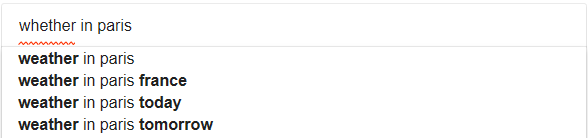
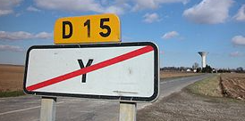
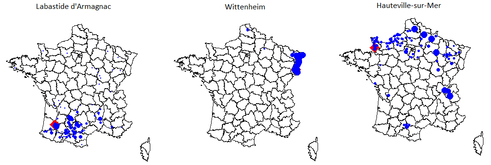
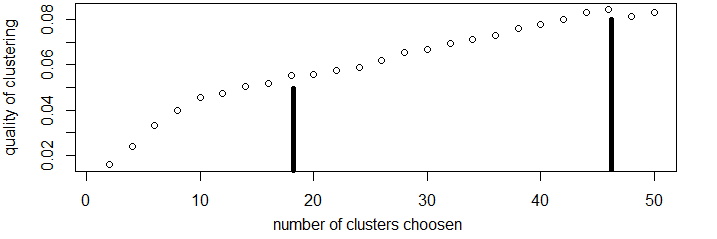
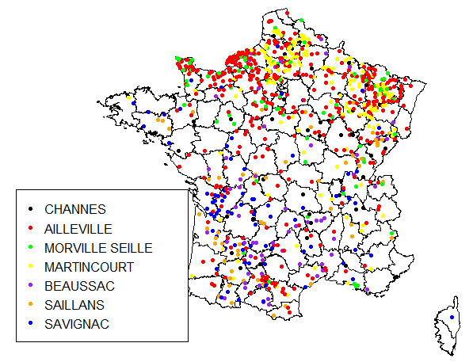

# citynames-clustering

When you type *whether in paris* in your browser it's quite obvious for everybody that you are actually asking for the "weather" not "whether". Indeed, the browser will immediately provide some search suggestions matching the word "weather" directly. But How does it knows? How did it decide that your query was wrong in the first place and corrected it? Such techniques involve computations known as "string distance". Indeed, two strings can be compared based on the number of common characters, the number of matching sub-sequences of N consecutives characters, or the number of edit operations needed to switch from one to the other. Dozens of related or combined metrics, more or less complicated, exist.



This project will try to use these tools to compare the names of the 35921 cities in France, some being as long as "SAINT MARTIN DE BIENFAITE LA CRESSONNIERE", others as short as 1 character ([one](https://fr.wikipedia.org/wiki/Y_(Somme)) is named just "Y" ). Clearly, those two will be hard to compare, right?



Once we have a metric (ideally between 0 and 1) to compare two random city names, we can do two fun things:
- plot all cities with a high matching score to any given city, on a map
- build a classification that will (hopefully) bring out meaningful clusters of cities with related names ("DIEFFENBACH AU VAL" and "DIEFFENBACH LES WOERTH") and tell us about French History... 

Actually, building knowledge out of city names is a rather classic geographical activity (it's called toponymy), and already has a dense litterature, though I couldn't find any usecase of statistical clustering on this kind of data. Those of you who aren't data scientists might feel a bit like John in the following almost-real-geeky-movie dialog (and are therefore allowed to skip some sections):

*"Robert, please tell me you have located the murderer?!"* / 
*"Well John, I got something but I had to relocate the satellite and run a 128bit decryption algorithm, then I checked the modified DNA database but I..."* / 
*"For God's sake Robert, what did you find?"*

All right, you got my point. Let's do some more Robert here. 

## 1. How do we get the cities database?

All cities and villages with GPS locations in France are available at the [data gouv platform](https://www.data.gouv.fr/fr/datasets/listes-des-communes-geolocalisees-par-regions-departements-circonscriptions-nd/); however for having repeatedly treated such data in electoral analysis, I was well aware of its poor quality and how it was a real pain to clean those rows for special characters, duplicates, missing GPS locations etc. In the discussion forum someone already had a cleaned dataset merged with data from LA POSTE (see the post [here](https://www.datavis.fr/index.php?page=validate-your-data)), with all names in upper case, no special character, 100% geolocated, just what I needed. We also imported a simplified geoshapeData file to get an emtpy map of France and its departments from [here](https://www.data.gouv.fr/fr/datasets/contours-des-departements-francais-issus-d-openstreetmap/). We excluded DOMTOM from the analysis.

## 2. Pretreat the data

For our specific use the data even has to be a bit transformed. The city names have a lot of stuff that seemed useless to compute proximities with, i'm talking about stuff like prepositions LE, EN, SUR, DE, etc. Indeed, AIRE-SUR-L'ADOUR and AIRE-SUR-LA-LYS are 1,000km away, have nothing in common except those *stop words* constructs and would wrongly appear in the same cluster if we didn't remove them. By doing so, we change their semantic proximity from 0.57 to 0.72. Same goes from all the religious names having SAINT/SAINTE(S) in them; but I had first to check if the geographical repartition of those religious names was spatially uniform, and it seemed to be the case. To achieve all these operations, I used chunks of code like this one:

```
gsub(" D[EU]?S? | L[EA]?S? | SAINTE? | SUR | AUX? | EN | ET | SOUS ", " ", com$nom)
```

We decided to keep the spaces and not collapse the components of the city names, because spaces are relevant. Some things I decided to keep, such as "notre dame", "lez", "pres", "es", because I thought they might bring some relevant historical perspective. So, remember that very long city name? Now it's become "MARTIN BIENFAITE CRESSONNIERE"!

## 3. Distance metrics

The hard part is to find the right string distance metric to describe the similarity between two city names. Most metrics are designed to deal with text misspell problems or variations, such as "GOOGLE" and "GOOGEL", and often cannot handle properly strings of very different lengths. The phenomenon we would like to capture are mainly:
- groups of letters, representing common historical origin like "SAINT REMY D'*URFE*" and "SAINT MARCEL D'*URFE*"
- small changes in letters, accounting for progressive transformation of the names through time, like: "BUSSIERE SAINT GEORGES" and "BUSSIERE**S** ET PRUNS" (see the S)

The first would be represented by an q-gram component of degree 3 or 4: "ARDILLERES" and "ARDILLEUX" have three 4-grams in common being ARDI, RDIL, and DILL. Their jaccard distance (~intersection/union) is : 1-3/11=0.7272. The second distance, called Levenshtein distance, computes the number of single-character changes to go grom one to the other, and needs to be normalized for the length of the string. We can build a weighted combination of those two indices. Let's check an example with the city of *"MONTIGNY (SUR) LOING"*

The first method gives proximities with : **"MONTIGNY", "MONTIGNY AIN", "MONTIGNY MONTS", "MONTIGNY LENCOUP", "MONTIGNY METZ", "MONTIGNY AVRE", "MONTIGNY AUBE", "MONTIGNY LENGRAIN"**, you see that it tends to keep the chunks.

The second method yields **"MONTIGNY AIN", "MONTIGNY MONTS", "FONTENAY LOING", "MONTIGNY ALLIER"**, but also stuff like **"MONTAGNY VEXIN", "ORBIGNY MONT", "MONTIGNAC COQ"**, accounting for small variations that might sometimes be irrelevant or too destructive, of course.

We could even think of adding some geographical weighting in the similarity, to favour grouping of cities that are not too far away from each other, but we didn't. Here is the final distance measure function; it is actually vectorized so that the computation can be done one entire column at the time, that speeds up dramatically the process:

```
dist002 = function(str1, str2)
{
  meas1 = stringdist::stringdist(a=str1, b=str2, method="cosine", q=3)
  meas2 = stringdist::stringdist(a=str1, b=str2, method="lv")/(nchar(str1) + nchar(str2))*2
  return((meas1 + meas2)/2)  
}
```

## 4. Check it out on the map

If you want to play with some cities similarities and see what it returns on a map of France, you can check out my [**little application HERE**](https://agenis.shinyapps.io/communes-toponymie-app/). You can mess with the distance metric as well. So, have you found your next holiday idea?



## 5. Let's get serious

Let's bring in some serious clustering algorithms, now; the usecase is not a "classic" clustering case, since we want to define our own measure of "distance" which is not trivial like euclidian, and every clustering need a way to compute a distance between couples of points. We will also have a scaling problem, since 36,000 rows means 1.3 billions of comparisons filled into a large triangular matrix. We will start with a random sample of size 15% of the whole dataset. Among the possible clustering techniques, we tested PAM (grouping cities around "parangons") and DBSCAN (grouping cities by agregating close cities iteratively). DBSCAN (density based clustering) automatically computed the number of clusters, given a minimum cluster size and point-to-point distance. What it shows, is that the more we restrict clusters to be sufficiently big, the more points go tho the "trash" cluster, meaning they get labelled as noise. This could mean that many many cities don't have sufficient proximity with a sufficient number of other cities.

| Min size of cluster | Nb of clusters obtained | % cities outside any cluster |
|---------------------|-------------------------|------------------------------|
| 1                   | 2522                    | 0%                           |
| 2                   | 319                     | 61%                          |
| 3                   | 111                     | 73%                          |
| 4                   | 65                      | 78%                          |
| 5                   | 33                      | 83%                          |
| 7                   | 14                      | 88%                          |
| 10                  | 8                       | 91%                          |

The problem with DBSCAN, is that it could group in the same cluster those three cities: "FOS SUR MER", "LA SEINE SUR MER", "NEUILLY SUR SEINE", "NEUILLY PLAISANCE" though the first and the last have nothing in common, except 2 transitionnal forms.

We don't have this effect with PAM clustering where each city is forced-assigned to a cluster and to be somewhat close to a cluster centroid (a *parangon*). But we thought that having a "noise cluster" is rather interessing, and we can actually duplicate it with PAM clustering by applying a threshold to our distance matrix: for every couple of points further than 0.6, we set their distance to almost infinite (1E4). 



Our problem remains to find the optimal number of clusters and its always an open question (see this [SO post](https://stackoverflow.com/q/15376075/3871924))
We liked to run a silhouette test (we won't get into the detail of what this indicator means) to determine where to stop, and 18 seemed a reasonable number; That way, the PAM outputs a big "messy" cluster (80% of all names), while the others stay very homogeneous. Let's have a look at the cluster centers (the most representative city of each cluster):

*"CHAPELLE", "CHANNES", "FONTAINE", "FERRIERES", "CHAMPAGNE", "WILLIERS", "AILLEVILLE", "MONTGERMONT", "MORVILLE SEILLE", "MARTINCOURT", "BEAUSSAC", "SAILLANS", "BOUILLY", "GERMAIN", "PIERRE BOIS", "MARIGNY", "REVELLES", "SAVIGNAC"*

And some extract of cities in several clusters:

| clus.center| cluster size | random members                                                                                                    |
|------------|--------------|-------------------------------------------------------------------------------------------------------------------|
| FONTAINE   | 58           | MONTAGNEY FONTENET FONTAINE LUCIEN FONTAINES OZILLAC FONTAINE AY MONTAGNY GAILLEFONTAINE TROISFONTAINES FONTELAYE |
| CHAMPAGNE  | 57           | CHAMPIS PAGNEY CAMPAGNAN CHAMPLIN CHAMPDRAY CHAMPEAUX DOMAGNE OUEN CHAMPAGNE CAMPAN CHAMPAGNAC                    |
| SAVIGNAC   | 78           | DIGNA PRIGNAC SAVINIEN AVIGNON SERVIGNEY SAVIN SAVIGNE LATHAN SAVIGNY FAYE SERIGNAN JOURGNAC                      |
| AILLEVILLE | 415          | CARDONVILLE BELLENGREVILLE JOUAVILLE GUNTZVILLER REBEUVILLE BILLEZOIS RANVILLE                                    |

Some of the clusters are quite interesting, for instance all the variations around the word "FONTAINE" (which means *fountain*), but others don't make much sense, like grouping every city with "VILLE" (meaning *city*) in it. We could also have tried testing the spatial coherence of each cluster.

So does all this makes sense on a map? Let us plot 7 of the most "location-specific" groups (the others are really spread all over the country, so it's not very informative). The legend shows the color of each group's representative city.  



Some interessing conclusions: most of the country seems to have a very wide range of city names, altough a couple of regions have strong naming specificities: Normandy, East (Alsace/Lorraine), Aquitaine.. Corsica didn't show up on the clusters, despite very "italian-sounding" names, it might be that the pattern were too diverse.

## 5. Prediction?

It could be fun to try to predict the location of a random city based on previous similarities, or even a totally fictitious city. The least stupid idea I came out with at 2.00am to achieve this is to test a new string against his 10 most related cities in the whole database, then sample their belonging departements with weights (the weights being the inverse of the distance metric), and return the department with highest probability. Let's try it (and for R experts, this function is a 25-lines dplyr piping):

```
predict.pam("TRUC MACHINVILLE-SUR-MER")
#   probability   dpmt_long
# 1       40.5%    Calvados
# 2       39.4%      Manche
# 3         11% Haute-Marne
```
Cool, right? Well, this prediction's guess is correct about only 20% of the time, so don't go crazy...

Anyway, this work was great to discover the capabilities and limits of clustering algorithms, they are not magic! We were also rapidly overwelmed by the computationnal complexity of the problem, and reached the limits of the computer on the whole dataset. I used a handy function called `CompuTimeEstimate` that I developped previously to estimate the computation time of a function before fully running it (it's available [here](https://gitlab.com/agenis/computation-time). The whole project was coded with R and R-Studio.
